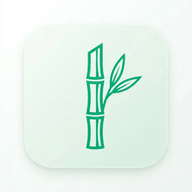
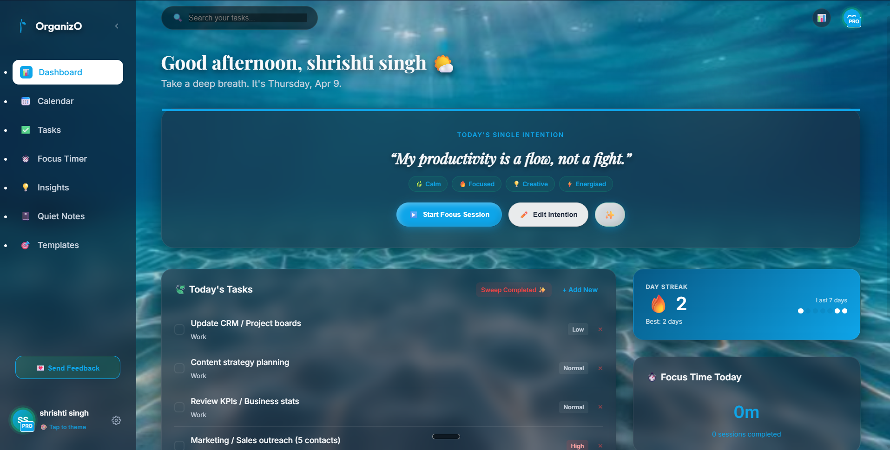

<div align="center">
  
  

  <h1>🌿 OrganizO</h1>
  <p><strong>Calm Productivity & Digital Sanctuary</strong></p>

  <p>
    <a href="https://shru089.github.io/OrganizO/"></a>
    <a href="#"></a>
    <a href="#"></a>
  </p>

  <a href="https://shru089.github.io/OrganizO/">
    
  </a>
  <br/>
  <br/>
  <i>Structure your life, gently.</i>
</div>

---

## 📖 About OrganizO

OrganizO is a premium, privacy-first progressive web application (PWA) built around the philosophy of creating a "Digital Sanctuary". It offers elegant task management, structured routines, a focus timer, and a rich-text journaling experience designed specifically to reduce digital anxiety.

## ✨ Key Features

| Feature | Description |
| :--- | :--- |
| **🎋 Sunlit Forest Theme** | High-quality bamboo forest aesthetics with interactive light particles to keep you grounded. |
| **⏱️ Zen Focus Timer** | Built-in Pomodoro logic with native OS system notifications and offline ambient soundscapes. |
| **📓 Rich Text Quiet Notes** | A markdown-lite WYSIWYG editor for your daily thoughts, automatically tracking your word count. |
| **📱 PWA & Offline First** | Designed to be fully installable on iOS and Android. No backend tracking—your data lives securely on your device. |
| **🎨 Dynamic Premium Themes** | Automatically shifts your browser interface and status bar colors to match themes like *Sakura Blush* and *Deep Ocean*. |
| **📊 Weekly Insights** | Local reporting mechanism designed to celebrate your consistency and focus streaks gracefully. |

---

## 🎨 Design Philosophy

OrganizO is built on the principle of **Calm Productivity**. Every design choice — from the emerald green tones to the slow easing functions — is intended to reduce stress and invite focus. 

OrganizO intentionally avoids a complex backend to maximize privacy, reduce server anxiety, eliminate loading screens, and allow **100% offline usage**. What you log in the app stays securely in your local browser storage. You can manually export and sync your vault anytime.

---

## 🛠️ Tech Stack

<div align="center">
  
  
  
  
</div>
<br>

- **Core**: Vanilla HTML5, CSS3, JavaScript
- **PWA Framework**: Web Manifest, Service Workers, Offline Caching
- **Design Elements**: Glassmorphism, CSS Grid & Flexbox layouts
- **Typography**: Playfair Display, Inter, Outfit (Google Fonts)

---

## 📂 Project Structure

```text
OrganizO/
├── index.html       # Landing Page & Marketing
├── app.html         # Main PWA Dashboard Workspace
├── js/
│   ├── app.js       # Core Application Class Logic
│   └── sw.js        # Service Worker (PWA Offline caching)
├── css/
│   ├── styles.css   # Global variables & landing styles
│   ├── app.css      # Dashboard layout and widgets
│   └── mobile.css   # Responsive media queries
├── manifest.json    # Android/iOS PWA Store Manifest
└── README.md
```

---

## 🚀 Getting Started

1. **Visit the Live Site**: Head over to [OrganizO Live App](https://shru089.github.io/OrganizO/) on your phone or laptop.
2. **Install**: Click **"Install App"** in your browser menu to download it as a native desktop or mobile application.
3. **Immerse**: Set a daily intention, start a focus timer, turn on the built-in soundscape, and reclaim your time gently.

---

<div align="center">
  <p><i>Built for focus, designed for peace.</i> 🎋</p>
</div>